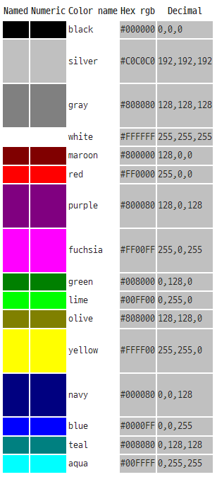

# HTML 소개

--

## [CSS Color keywords](https://www.w3.org/wiki/CSS/Properties/color/keywords)

-   CSS3에서 제공하는 색상은 17개의 Basic Colors와 130개의 Extends Colors로 총 147개를 제공한다.

##### Basic Colors

##### 모든 색상 list

-   aliceblue
-   antiquewhite
-   aqua
-   aquamarine
-   azure
-   beige
-   bisque
-   black
-   blanchedalmond
-   blue
-   blueviolet
-   brown
-   burlywood
-   cadetblue
-   chartreuse
-   chocolate
-   coral
-   cornflowerblue
-   cornsilk
-   crimson
-   cyan
-   darkblue
-   darkcyan
-   darkgoldenrod
-   darkgray
-   darkgreen
-   darkgrey
-   darkkhaki
-   darkmagenta
-   darkolivegreen
-   darkorange
-   darkorchid
-   darkred
-   darksalmon
-   darkseagreen
-   darkslateblue
-   darkslategray
-   darkslategrey
-   darkturquoise
-   darkviolet
-   deeppink
-   deepskyblue
-   dimgray
-   dimgrey
-   dodgerblue
-   firebrick
-   floralwhite
-   forestgreen
-   fuchsia
-   gainsboro
-   ghostwhite
-   gold
-   goldenrod
-   gray
-   green
-   greenyellow
-   grey
-   honeydew
-   hotpink
-   indianred
-   indigo
-   ivory
-   khaki
-   lavender
-   lavenderblush
-   lawngreen
-   lemonchiffon
-   lightblue
-   lightcoral
-   lightcyan
-   lightgoldenrodyellow
-   lightgray
-   lightgreen
-   lightgrey
-   lightpink
-   lightsalmon
-   lightseagreen
-   lightskyblue
-   lightslategray
-   lightslategrey
-   lightsteelblue
-   lightyellow
-   lime
-   limegreen
-   linen
-   magenta
-   maroon
-   mediumaquamarine
-   mediumblue
-   mediumorchid
-   mediumpurple
-   mediumseagreen
-   mediumslateblue
-   mediumspringgreen
-   mediumturquoise
-   mediumvioletred
-   midnightblue
-   mintcream
-   mistyrose
-   moccasin
-   navajowhite
-   navy
-   oldlace
-   olive
-   olivedrab
-   orange
-   orangered
-   orchid
-   palegoldenrod
-   palegreen
-   paleturquoise
-   palevioletred
-   papayawhip
-   peachpuff
-   peru
-   pink
-   plum
-   powderblue
-   purple
-   red
-   rosybrown
-   royalblue
-   saddlebrown
-   salmon
-   sandybrown
-   seagreen
-   seashell
-   sienna
-   silver
-   skyblue
-   slateblue
-   slategray
-   slategrey
-   snow
-   springgreen
-   steelblue
-   tan
-   teal
-   thistle
-   tomato
-   turquoise
-   violet
-   wheat
-   white
-   whitesmoke
-   yellow
-   yellowgreen
